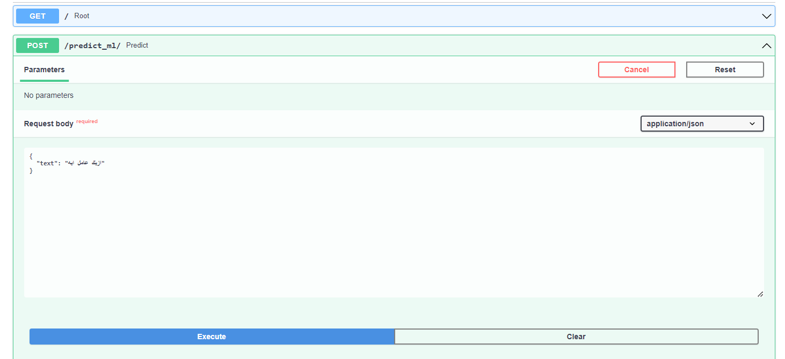
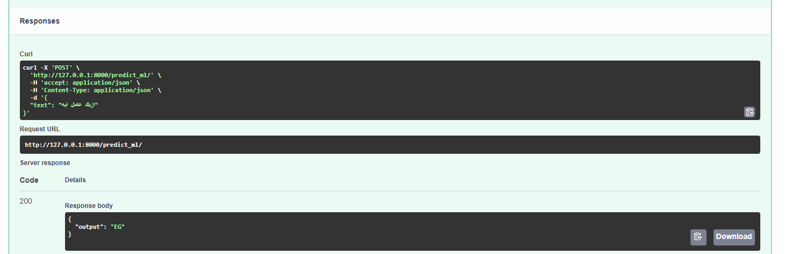
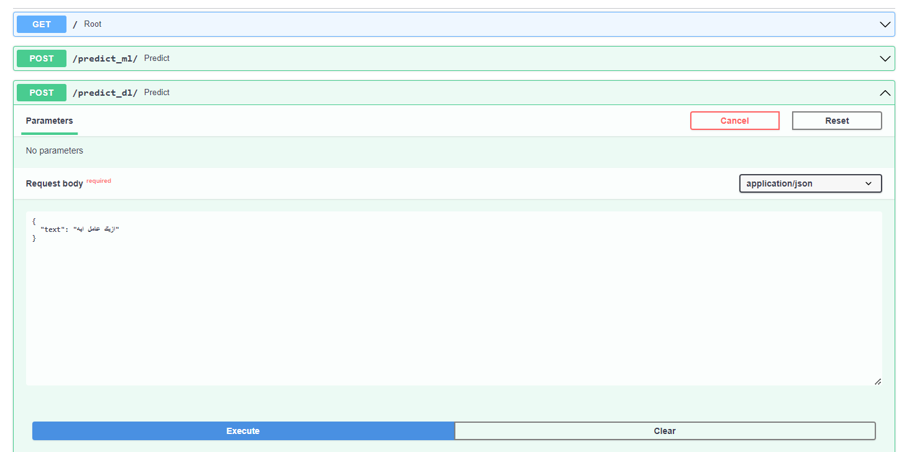
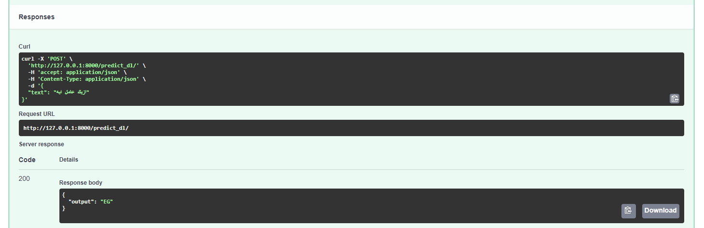

<center align="center">
<h1 align="center"><font size="+4">Arabic Dialect Classification</font></h1>
</center>

<h1 color="green"><b>Abstract</b></h1>
<p>Though Arabic is the lingua franca of most of the MENA region, different dialects of Arabic are used in different countries. While some dialects may differ significantly
from each other, others, particularly those in close in geographic proximity, may be more difficult to tweak apart. Automatically distinguishing between the different dialectal variations is valuable for many downstream applications such as machine translations, POS tagging, geo-locating users, and author profiling.</p>

<h1 color="green"><b>Tried Methods</b></h1>
<ol>
<li>TF-IDF + Linear SVM</li>
<li>Keras Embedding Layer + LSTM</li>
<li>Arabert Transformer Embedding + LSTM</li>
<li>Fine-tuning Arabert Transformer</li>
</ol>

<h1 color="green"><b>Training Dataset</b></h1>
<p>QADI dataset was used for this specific task. In this <a href="https://arxiv.org/pdf/2005.06557.pdf">paper</a>, the researcher has automatically collected a dataset of tweets belonging to a wide range of country-level Arabic dialects covering 18 different countries in the Middle East and North Africa region. Building this dataset relied on applying multiple filters to identify users who belong to different countries based on their account descriptions and to eliminate tweets that are either written in Modern Standard Arabic or contain inappropriate language. Using intrinsic evaluation, the labels of a set of randomly selected tweets were 91.5% accurate.</p>

<h1 color="green"><b>Application</b></h1>
<p>The SVM model and Fine-tuned Transformer were the models used to build an API using a new easy web framework which is FastAPI. In order to try out the application, please follow the following instructions:</p>

1. Install all Python libraries that the notebooks depend on:

```python
pip install -r requirements.txt
```

2. Download files needed from these links: -<a href="https://drive.google.com/file/d/1dvtXwdMghOQNC0lP_qPT4OXZz_XN3ebC/view">TF-IDF</a>
-<a href="https://drive.google.com/file/d/1qoiulklaR5co2z3YiG4ZuibhtRIQ5UvZ/view">SVM-Model</a>
-<a href="https://drive.google.com/file/d/1yOaqkUGAamXc15xy3oW16_aQijEBRZ5_/view">Finetuned-Transformer-Weights</a>

3. Clone the Arabert repo:
```python
git clone https://github.com/aub-mind/arabert.git
```

4. Run the server:

```python
python App_FastAPI.py -t [Tfidf Path] -ml [SVM Model Path] -dl [Transformer Weights Path]
```

5. Navigate to your local host `http://localhost:8000/docs`

6. Assign the text that needs to be classified


<h1 color="green"><b>Demo</b></h1>




